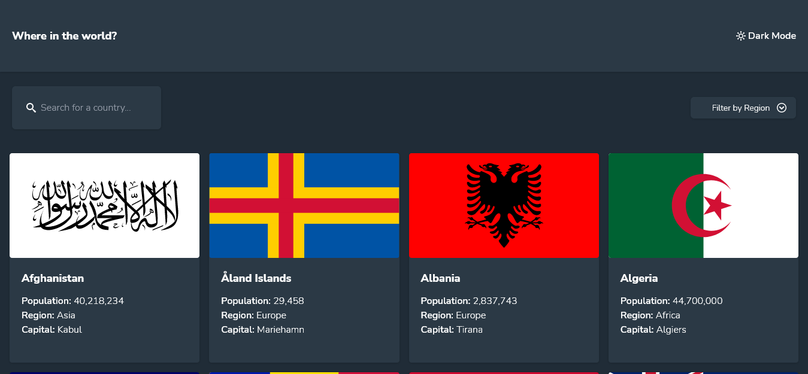

# Frontend Mentor - REST Countries API with color theme switcher solution

This is a solution to the [REST Countries API with color theme switcher challenge on Frontend Mentor](https://www.frontendmentor.io/challenges/rest-countries-api-with-color-theme-switcher-5cacc469fec04111f7b848ca). Frontend Mentor challenges help you improve your coding skills by building realistic projects. 

## Table of contents

- [Overview](#overview)
  - [The challenge](#the-challenge)
  - [Screenshot](#screenshot)
  - [Links](#links)
- [My process](#my-process)
  - [Built with](#built-with)
  - [What I learned](#what-i-learned)
  - [Continued development](#continued-development)
  - [Useful resources](#useful-resources)

## Overview

### The challenge

Users should be able to:

- See all countries from the API on the homepage
- Search for a country using an `input` field
- Filter countries by region
- Click on a country to see more detailed information on a separate page
- Click through to the border countries on the detail page
- Toggle the color scheme between light and dark mode

### Screenshot

### Links

- Live Site URL: [Visit live site](https://celebrated-medovik-87fb85.netlify.app/)

## My process

### Built with

- Flexbox
- CSS Grid
- Mobile-first workflow
- [React](https://reactjs.org/) - JS library
- [TailwindCSS](https://tailwindcss.com/) - CSS framework

### What I learned

This project used many of the skills I've practiced in previous projects. It was a great way to bring all those skills together in one project. In particular, I used JavaScript's built-in array methods (sort, filter) to search for a country, filter by region, and sort the country's alphabetically.

### Continued development

I'd like to continue to work with TailwindCSS. For the dropdown menu I used one designed by TailwindCSS. So, I still have more to learn with Tailwind. 

### Useful resources

- [TailwindCSS dropdown menu](https://tailwindui.com/components/application-ui/elements/dropdowns) - Provided the base solution for the dropdown menu in the project which I modified slightly
